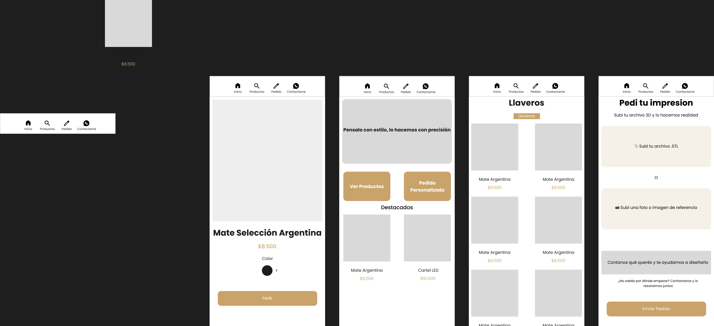
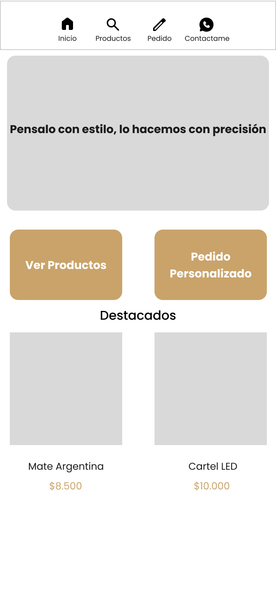
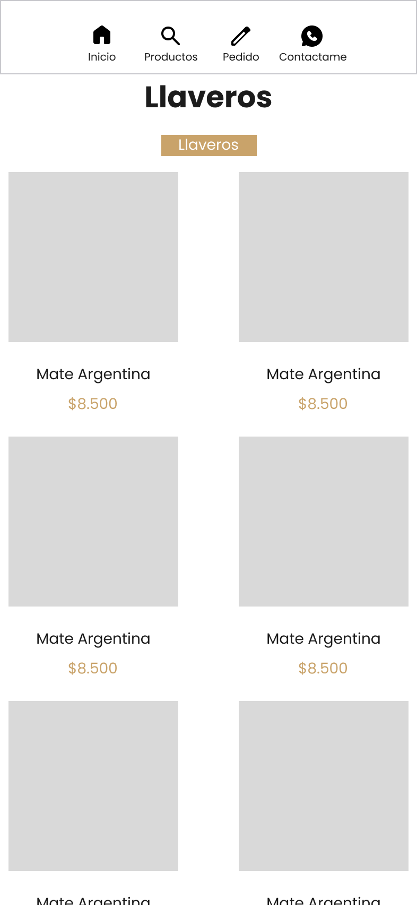
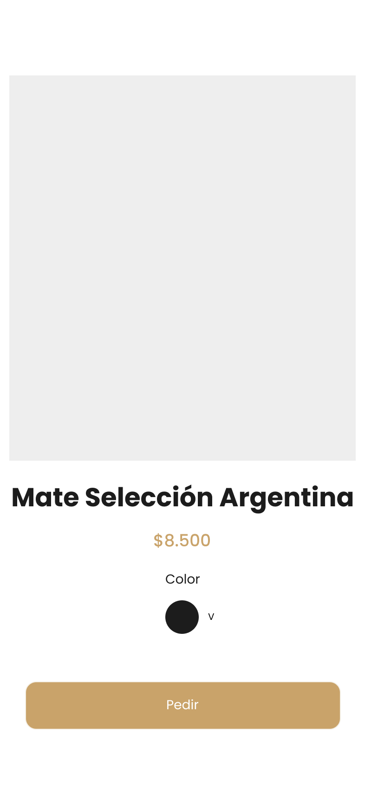
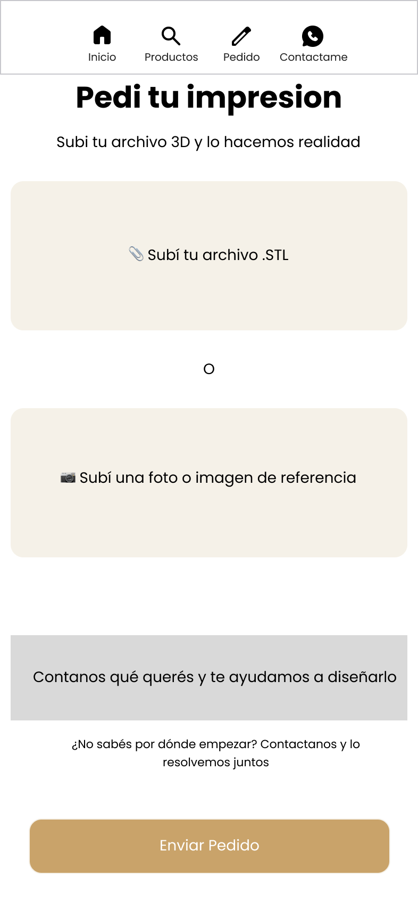

# Santo Estudio — Diseño de tienda mobile

Diseño de la primera tienda online (mobile-first) para **Santo Estudio**, una marca maker de impresión 3D que hasta ahora vendía únicamente por Instagram.

> **Rol:** Diseño de producto / UI · **Herramienta:** Figma · **Tipo:** Proyecto real, validado con el dueño de la marca.

<!-- Reemplazá esta línea por la imagen general de tus 4 pantallas -->

---

## El proyecto

Santo Estudio es una tienda maker 3D que ofrece dos cosas: **productos ya diseñados** (mates, llaveros, carteles LED, decoración) y **pedidos personalizados**. Su slogan: *"Pensalo con estilo, lo hacemos con precisión"*.

El negocio funcionaba 100% por Instagram: los clientes veían las publicaciones y consultaban por mensaje. No existía una tienda donde navegar los productos ni un flujo claro para encargar algo a medida.

## El desafío

Diseñar una tienda mobile que:

- Mostrara el catálogo de forma ordenada y profesional.
- Respetara la identidad ya existente de la marca, sin imponer una nueva.
- Contemplara el pedido personalizado, que es parte central del negocio.
- Se adaptara a **cómo vende la marca de verdad** (por consulta, no por checkout tradicional).

## Mi proceso

1. **Investigación de marca.** Analicé el Instagram de Santo Estudio: logo, paleta, tipo de productos y, sobre todo, cómo interactúan con sus clientes.
2. **Sistema de diseño.** Definí colores y tipografías de marca como estilos reutilizables antes de diseñar pantallas.
3. **Componentes.** Construí piezas reutilizables (tarjeta de producto y barra de navegación) para mantener coherencia y agilizar el trabajo.
4. **Diseño del flujo.** Diseñé las pantallas clave y las conecté con una navegación común.
5. **Validación.** Revisé las decisiones con el dueño de la marca y ajusté según su feedback real.

---

## Decisiones de diseño clave

Esta es la parte que más valor tuvo del proyecto: cada pantalla responde a una decisión pensada, no a una plantilla.

### 1. Fondo neutro para que brillen los productos
Mi primer instinto fue un diseño "colorido y creativo". Pero al mirar el feed, los productos **ya aportan todo el color** (carteles LED, floreros, llaveros). Si la interfaz también era colorida, competía con ellos. Opté por un **fondo neutro en tonos crema** tomados del logo, dejando que las fotos de los productos sean las protagonistas.

### 2. Saqué el selector de material
Tenía pensado un selector de material (PLA / PETG / Resina). Al consultarlo con la marca, **no ofrecen elegir material**, así que lo eliminé. Diseñar funciones que el negocio no usa solo agrega ruido.

### 3. Selector de color solo cuando aplica
Algunos productos tienen color fijo y otros tienen variantes. La ficha muestra el **selector de color únicamente en los productos con opciones**; en los de diseño único, la ficha queda más directa.

### 4. "Pedir" por WhatsApp, no carrito
La marca no se maneja con carrito ni checkout: vende por consulta. Por eso el botón principal es **"Pedir"**, que abre WhatsApp con un **mensaje pre-armado con la información del producto** (nombre y color elegido). Es exactamente cómo operan las mejores tiendas de Instagram en Argentina: menos fricción para el cliente y para la marca.

### 5. Pantalla de pedido pensada para todos
La pantalla "Pedí tu impresión" no asume que el cliente sea técnico. Ofrece tres caminos: subir un archivo **.STL** (para quien sabe), **subir una foto de referencia** (para quien tiene una idea visual), y un acceso a **contacto directo** para quien no sabe por dónde empezar.

---

## Pantallas

<!-- Reemplazá cada línea por la imagen correspondiente -->

**Home** — la cara de la tienda, con las dos puertas de entrada (comprar y pedido personalizado).

**Catálogo** — grilla de productos.

**Ficha de producto** — con selector de color y botón "Pedir" a WhatsApp.

**Pedí tu impresión** — el flujo de pedido personalizado.

---

## Qué aprendí

Este fue mi primer proyecto de diseño de producto de punta a punta. En el proceso aprendí a usar Figma desde cero: frames, estilos, componentes e instancias, y a estructurar un sistema de diseño. Pero lo más importante fue entender que **diseñar no es decorar pantallas, sino resolver el problema de un negocio real** — y para eso hay que entender cómo funciona ese negocio antes de dibujar nada.

## Próximos pasos

- Implementar la tienda en código (HTML/CSS o una plataforma de ecommerce).
- Conectar el botón "Pedir" con la API de WhatsApp (`wa.me`) para generar el mensaje automático.

---

*Diseñado por Ismael Gabriel Paez · [LinkedIn](https://www.linkedin.com/in/ismael-gabriel-paez-745502338/)*
